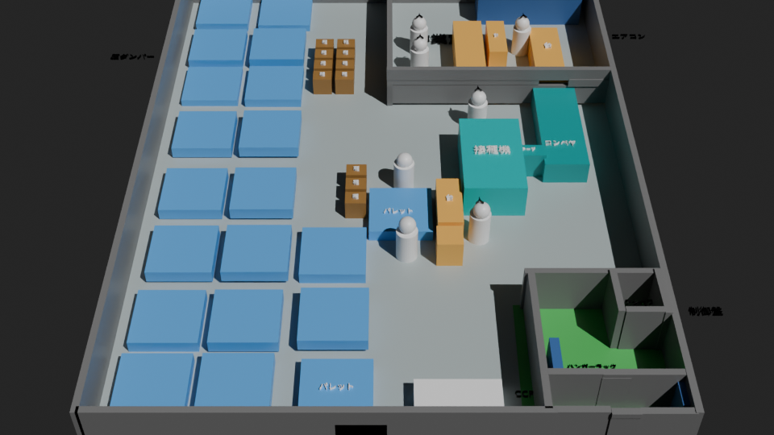
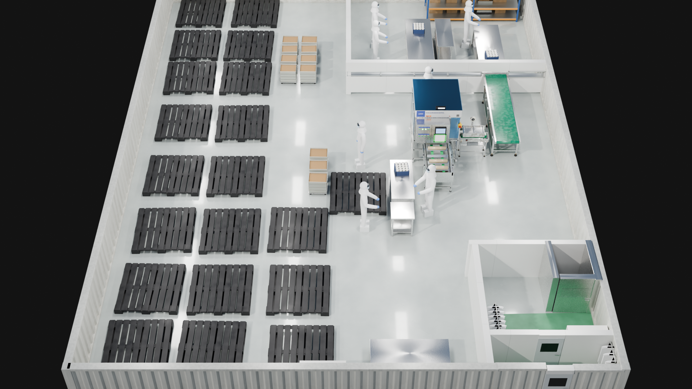
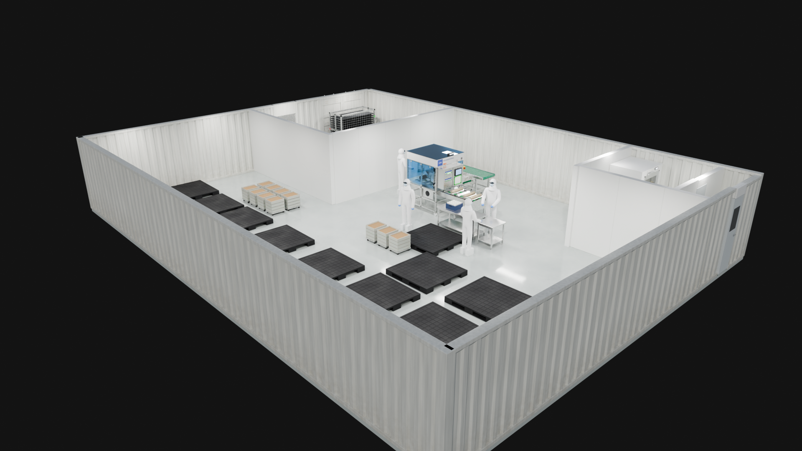
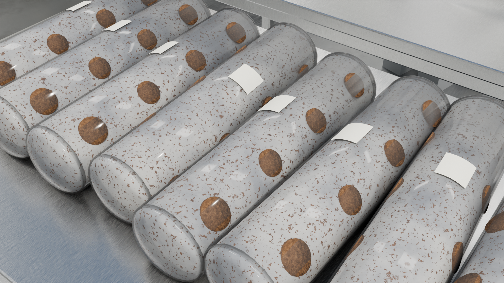
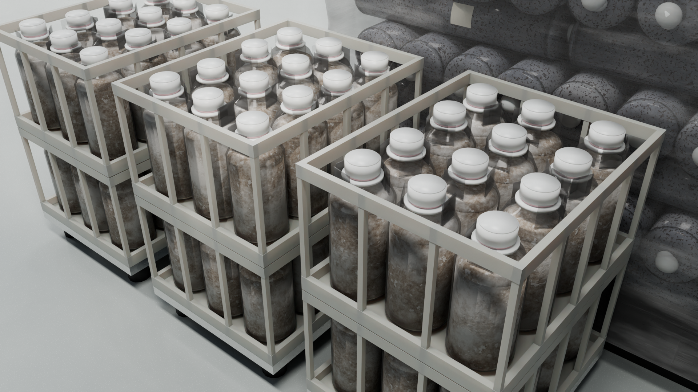

# レイアウト模型のリアル化

`blend9.26.blend`（単色の箱で組んだ工場レイアウト）を、配置と寸法はそのままに、実物に近い形状・質感・照明に置き換えたものです。

| 元モデル | リアル化（元カメラ） |
|---|---|
|  |  |

斜め俯瞰（追加カメラ `Camera_斜め俯瞰`）:



作業台の上の菌棒:



袋入りの種菌（格子カゴ2段）:



## ファイル

- `layout_realistic.blend` … 完成シーン（Blender 5.0 で保存。5.x でそのまま開けます）
- `make_realistic.py` … 変換スクリプト。元の .blend に対して何度でも再実行できます
- `renders/` … レンダー画像

## 置き換えた内容

| 元の箱 | 置き換え後 |
|---|---|
| パレット ×20 | 1500角の黒い樹脂（プラスチック）パレットです。一体成形の平らなデッキに、縁のリムと格子リブ、滑り止めの凹凸を付けました。下には脚ブロック9か所と下桁3本があります。上には何も載せていません |
| 種トレー ×11 | 写真をもとに、袋入りの種菌に作り直しました。台車に格子カゴを2段積み、1段に4×3の12袋を立てて並べています。袋は直径11cm弱・高さ約24cmで、透明の袋に、茶色のおが粉と白い菌糸のかたまり・小さな白い粒が見える種菌を詰めています。口は白い樹脂のカラーに通してキャップをしており、すき間からピンクの綿栓がのぞきます |
| 接種機 | 実機の写真をもとに作り直しました。ステンレス角パイプのフレーム（キャスター付き・下部に縦格子）、青いアクリルの囲い（ヒンジ・ラッチ付き）、看板ヘッダー（「金博洋 / 纯电动香菇固体接种机」の文字はメッシュ化）、操作盤（押しボタンと表示灯、タッチパネル、緑テープで貼った紙）、非常停止ボタン、カウンター表示、ホッパー、モーター、チェーン、オイラーボトル、ルーバー付きの箱、V字の桟と緑ベルトの供給コンベヤ（菌床袋を載せた状態）。高さは作業者と釣り合う実寸（約1.9m）です |
| コンベヤ | 写真をもとに作り直しました。緑のPVC平ベルト（リターン側と両端の巻き付きも再現）、ステンレスのフレーム、角パイプの脚（上部のテーパー金具、真鍮のねじ棒とゴム足のアジャスタ、下部のつなぎ材）、端の駆動ボックスとモーター、切替スイッチ。ベルトの上には何も置いていません。ベルトの下には、オレンジの電源ボックスと巻いたコードがあります。ベルト面の高さは接種機にそろえて0.75mです |
| テープ | 写真をもとに作り直したテープ貼り機です。接種機とコンベヤの間にあり、ベルトは接種機からコンベヤの方向に走ります。緑の歯付きグリップベルト2本（縦プーリーで周回）、使用感のあるステンレスの側板（ボルト留め）、縦アームの先の白いテープロール、赤い押しボタン、フランジ軸受、ファン付きの灰色モーター、テーパー金具付きの脚があります |
| 台 ×5 | 下段棚付きのステンレス作業台。3台の上に、写真をもとにした菌棒を横倒しで並べています（8本・8本・5本） |
| 菌棒 | 直径12cm・長さ52cmの袋入り菌床です。中身は白〜灰色の菌糸に、おが粉の茶色い粒が透けて見えます。接種穴の種菌（濃い茶色の粒状）が3列で千鳥に並び、その上を透明フィルムで覆っています。表面には白いマスキングテープを1枚貼っています。どの面が上になるかは1本ずつ変えています |
| 棚 | 写真をもとに、菌床トレー用の移動ラック1台に作り直しました（幅1.8m・奥行き0.8m・高さ2.15m。観音開き扉より少し小さくし、扉の正面に配置）。亜鉛メッキの角パイプフレームで、前後2列に黒い樹脂トレー（のこぎり状の山と抜き穴）を21段載せています。前後の面にはステンレスの縦ワイヤー、支柱には赤・緑テープの目印があり、下はキャスターです |
| ハンガーラック ×2 | ステンレスのパイプラック＋吊るした防塵服。2台ともエアシャワーのある部屋の西の壁ぎわに並べています |
| CCP | ステンレス天板の白いベンチキャビネット |
| FFU | 壁付けのファンフィルタユニット（吹出しグリル・表示灯） |
| 人 ×7 | 防塵服・フード・ゴーグル・マスク・ニトリル手袋・長靴の作業者。近くの設備の方を向かせています |
| 外周の壁 | コンテナの台形波板鋼板（ピッチ278mm・深さ36mm、実形状、高さ2.65m）。上下のレールと四隅のコーナーポストがあり、オフホワイトの塗装に下部の汚れや点状のシミを入れています |
| コンテナ扉 | 作業室の棚の後ろ（北側の外周壁）の右寄りに、観音開きの扉を付けました（開口 幅2.3m・高さ2.5m）。内側は白い扉で、横方向の波、縦框、上下の横板とボルト頭、黒い合わせ目があります。外側は横方向の波に、ロッキングバー（1枚2本）、カムキーパー、バーガイド、ハンドル、ヒンジ、黒いガスケット、黄黒の注意ステッカー、銘板を付けています |
| 片開き扉 | 観音開き扉の左側に、冷凍コンテナ風の片開き扉を付けました（開口 幅0.9m・高さ1.85m）。外側は平らな白い扉で、アルミ額縁とリベット、亜鉛メッキの大型ヒンジ3か所、クロームのレバーラッチと受け、引き手、下部の黒いプランジャーがあります。内側はステンレスで、縦溝で3分割し、ベージュのパドル付き内開放ノブを付けています |
| 間仕切り壁 | 1200ピッチ目地の白いクリーンルームパネルです。扉には窓と取っ手を付けました |
| エアシャワー | 寸法図（PCJ-88JPM4）を参考に作り直しました。外形 W1200×D1000×H2100、通路幅800です。左右のダクト柱の内壁はステンレスで、ノズルが3段×2列、天井にも2個あります（合計14個）。下部にプレフィルタのルーバー、天井にLED照明とイオン発生器、入口側の外側に表示器があります。入口と出口には強化ガラス窓付きのアルミ扉を付け、取っ手、ドアクローザー、ドアロック解除スイッチもあります。出口側の壁には扉の位置に開口をあけています |
| 作業室との仕切り | 窓も隙間も無い1枚の壁に作り直しました。コンベヤが通る位置にだけ、長方形の開口（幅0.86m・高さ0.3〜1.05m、ステンレス枠付き）をあけています |
| 床 | メインの作業場はエポキシ塗床です。壁で仕切られた部屋（前室・作業室）は鉄板の床にしました（厚み6mm、1200×2400割付の目地、色ムラ・擦り傷・汚れ入り） |
| ラベルだけの項目 | 入口側の小部屋に靴箱（幅0.7m）を追加し、入って右の壁に付けています |
| 土間 | 入口の小部屋の入ってすぐのところに、住宅の玄関のような土間を作りました。床から15cm下げてグレーのタイル（300角・目地入り）を貼り、奥側の段差には木の上がり框を付けています |

マテリアルはすべてプロシージャルで作っているので、外部の画像ファイルは不要です。

建物の外側（周りの空間）は変更していません。地面は置かず、カメラに映る背景も元ファイルと同じダークグレーのままです。室内を照らすため、照明には次の3つを使っています。どれもカメラには直接映りません。

- 空の環境光
- 太陽光
- 天井LEDを想定した面光源24灯

壁の高さは、コンテナの外周壁が2.65m、部屋の間の仕切り壁が元のモデルの2倍の2.4mです（仕切りの扉も同じ比率で高くしています）。天井はない断面表示です。

## 元データの扱い

- 元の箱オブジェクトは、コレクション `元レイアウト_箱モデル(非表示)` に移してあります（削除はしていません）
- ラベル文字は、コレクション `ラベル文字(非表示)` に移してあります。アウトライナーでこのコレクションのチェックを入れると、ラベルが再び表示されます
- `_アセット` は、インスタンスの元データを置くコレクションです（ビューレイヤーからは除外）

## レンダー設定

Cycles、256サンプル（適応サンプリング）、OpenImageDenoise、AgX（Medium High Contrast）、1920×1080。  
GPUがある場合は「プリファレンス → システム → Cycles レンダーデバイス」で有効にすると速くなります。

## スクリプトの再実行

```
blender -b 元ファイル.blend -P make_realistic.py -- 出力.blend
```
