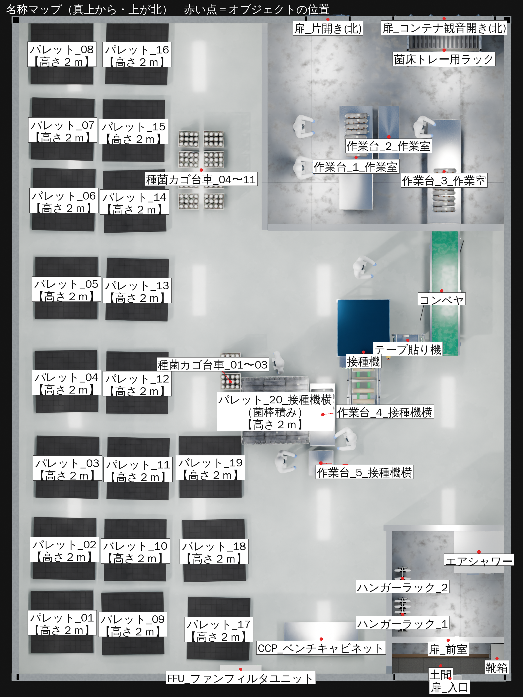

# レイアウト模型のリアル化

`blend9.26.blend`（単色の箱で組んだ工場レイアウト）を、配置と寸法はそのままに、実物に近い形状・質感・照明に置き換えたものです。

| 元モデル | リアル化（元カメラ） |
|---|---|
|  |  |

斜め俯瞰（追加カメラ `Camera_斜め俯瞰`）:


## ファイル

- `layout_realistic.blend` … 完成シーン（Blender 5.0 で保存。5.x でそのまま開けます）
- `make_realistic.py` … 変換スクリプト。元の .blend に対して何度でも再実行できます
- `renders/` … レンダー画像

## 置き換えた内容

| 元の箱 | 置き換え後 |
|---|---|
| パレット ×20 | 1500角の黒い樹脂（プラスチック）パレットです。一体成形の平らなデッキに、縁のリムと格子リブ、滑り止めの凹凸を付けました。下には脚ブロック9か所と下桁3本があります。接種機にいちばん近いパレット1枚（`パレット_20_接種機横`）にだけ、ストレッチフィルムで巻いた接種前の菌棒を積んでいます。残りの19枚は空です |
| 種トレー ×11 | 台車付きの樹脂トレー4段積み、中身はおが粉の種菌 |
| 接種機 | 実機の写真をもとに作り直しました。ステンレス角パイプのフレーム（キャスター付き・下部に縦格子）、青いアクリルの囲い（ヒンジ・ラッチ付き）、看板ヘッダー（「金博洋 / 纯电动香菇固体接种机」の文字はメッシュ化）、操作盤（押しボタンと表示灯、タッチパネル、緑テープで貼った紙）、非常停止ボタン、カウンター表示、ホッパー、モーター、チェーン、オイラーボトル、ルーバー付きの箱、V字の桟と緑ベルトの供給コンベヤ（菌床袋を載せた状態）。高さは作業者と釣り合う実寸（約1.9m）です |
| コンベヤ | 写真をもとに作り直しました。緑のPVC平ベルト（リターン側と両端の巻き付きも再現）、ステンレスのフレーム、角パイプの脚（上部のテーパー金具、真鍮のねじ棒とゴム足のアジャスタ、下部のつなぎ材）、端の駆動ボックスとモーター、切替スイッチ。ベルトの上には何も置いていません。ベルトの下には、オレンジの電源ボックスと巻いたコードがあります。ベルト面の高さは接種機にそろえて0.75mです |
| テープ | 写真をもとに作り直したテープ貼り機です。接種機とコンベヤの間にあり、ベルトは接種機からコンベヤの方向に走ります。緑の歯付きグリップベルト2本（縦プーリーで周回）、使用感のあるステンレスの側板（ボルト留め）、縦アームの先の白いテープロール、赤い押しボタン、フランジ軸受、ファン付きの灰色モーター、テーパー金具付きの脚があります |
| 台 ×5 | 下段棚付きのステンレス作業台 |
| 棚 | 写真をもとに、菌床トレー用の移動ラック1台に作り直しました（幅1.8m・奥行き0.8m・高さ2.15m。観音開き扉より少し小さくし、扉の正面に配置）。亜鉛メッキの角パイプフレームで、前後2列に黒い樹脂トレー（のこぎり状の山と抜き穴）を21段載せています。前後の面にはステンレスの縦ワイヤー、支柱には赤・緑テープの目印があり、下はキャスターです |
| ハンガーラック ×2 | ステンレスのパイプラック＋吊るした防塵服。2台ともエアシャワーのある部屋の西の壁ぎわに並べています |
| CCP | ステンレス天板の白いベンチキャビネット |
| FFU | 壁付けのファンフィルタユニット（吹出しグリル・表示灯） |
| 人 ×7 | 防塵服・フード・ゴーグル・マスク・ニトリル手袋・長靴の作業者。近くの設備の方を向かせています |
| 外周の壁 | コンテナの台形波板鋼板（ピッチ278mm・深さ36mm、実形状、高さ2.65m）。上下のレールと四隅のコーナーポストがあり、オフホワイトの塗装に下部の汚れや点状のシミを入れています |
| コンテナ扉 | 作業室の棚の後ろ（北側の外周壁）の右寄りに、観音開きの扉を付けました（開口 幅2.3m・高さ2.5m）。内側は白い扉で、横方向の波、縦框、上下の横板とボルト頭、黒い合わせ目があります。外側は横方向の波に、ロッキングバー（1枚2本）、カムキーパー、バーガイド、ハンドル、ヒンジ、黒いガスケット、黄黒の注意ステッカー、銘板を付けています |
| 片開き扉 | 観音開き扉の左側に、冷凍コンテナ風の片開き扉を付けました（開口 幅0.9m・高さ1.85m）。外側は平らな白い扉で、アルミ額縁とリベット、亜鉛メッキの大型ヒンジ3か所、クロームのレバーラッチと受け、引き手、下部の黒いプランジャーがあります。内側はステンレスで、縦溝で3分割し、ベージュのパドル付き内開放ノブを付けています |
| 間仕切り壁 | 1200ピッチ目地の白いクリーンルームパネルです。扉には窓と取っ手を付けました |
| エアシャワー | 寸法図（PCJ-88JPM4）を参考に作り直しました。外形 W1200×D1000×H2100、通路幅800です。左右のダクト柱の内壁はステンレスで、ノズルが3段×2列、天井にも2個あります（合計14個）。下部にプレフィルタのルーバー、天井にLED照明とイオン発生器、入口側の外側に表示器があります。入口と出口には強化ガラス窓付きのアルミ扉を付け、取っ手、ドアクローザー、ドアロック解除スイッチもあります。出口側の壁には扉の位置に開口をあけています |
| 作業室との仕切り | 窓も隙間も無い1枚の壁に作り直しました。コンベヤが通る位置にだけ、長方形の開口（幅0.86m・高さ0.3〜1.05m、ステンレス枠付き）をあけています |
| 床 | メインの作業場はエポキシ塗床です。壁で仕切られた部屋（前室・作業室）は鉄板の床にしました（厚み6mm、1200×2400割付の目地、色ムラ・擦り傷・汚れ入り） |
| ラベルだけの項目 | 入口側の小部屋に靴箱（幅0.7m）を追加し、入って右の壁に付けています |
| 土間 | 入口の小部屋の入ってすぐのところに、住宅の玄関のような土間を作りました。床から15cm下げてグレーのタイル（300角・目地入り）を貼り、奥側の段差には木の上がり框を付けています |

マテリアルはすべてプロシージャルで作っているので、外部の画像ファイルは不要です。

建物の外側（周りの空間）は変更していません。地面は置かず、カメラに映る背景も元ファイルと同じダークグレーのままです。室内を照らすため、照明には次の3つを使っています。どれもカメラには直接映りません。

- 空の環境光
- 太陽光
- 天井LEDを想定した面光源24灯

壁の高さは、コンテナの外周壁が2.65m、部屋の間の仕切り壁が元のモデルの2倍の2.4mです（仕切りの扉も同じ比率で高くしています）。天井はない断面表示です。

## オブジェクトの名称

アウトライナーでは、オブジェクトが `リアル化` の下にカテゴリ別に並んでいます。3Dビューポートでは主な設備の名前が表示されます（作業者の名前は表示していません。設定場所は オブジェクトプロパティ → ビューポート表示 → 名前）。配置と名前の対応は次の図のとおりです。



| コレクション | 主なオブジェクト名 |
|---|---|
| 01_設備 | `接種機`、`コンベヤ`、`テープ貼り機`、`エアシャワー`、`CCP_ベンチキャビネット`、`FFU_ファンフィルタユニット`、`接種機_看板文字_1〜4`、`接種機_供給コンベヤ上の菌床袋_1〜3` |
| 02_パレット | `パレット_01【高さ２ｍ】`〜`パレット_20_接種機横【高さ２ｍ】`（西の列から南→北の順）、`菌棒積み_パレット20上(接種機横)` |
| 03_作業台 | `作業台_1〜3_作業室`、`作業台_4〜5_接種機横` |
| 04_ラック・収納 | `菌床トレー用ラック`、`ラック_菌床トレー_01〜21段_手前/奥`、`ハンガーラック_1〜2`、`靴箱` |
| 05_種菌カゴ台車 | `種菌カゴ台車_01〜11` |
| 06_菌棒(作業台上) | `菌棒_作業台1上_01` など |
| 07_作業者 | `作業者_01〜07`（防塵服は `作業者_xx_装備`） |
| 08_建物(壁・床・扉) | `外周壁_波板_北/南/東/西`、`外周壁_レール_…`、`仕切り壁_…`、`扉_コンテナ観音開き(北)`、`扉_片開き(北)`、`扉_前室`、`扉_入口`、`床_エポキシ塗床`、`床_鉄板_作業室/前室`、`土間` |
| 09_カメラ・太陽光 | `カメラ`（真上）、`Camera_斜め俯瞰`、`サン` |

非表示の元の箱には `元箱_` を、ラベル文字には `ラベル_` を名前の頭に付けています（例 `元箱_接種機`、`ラベル_接種機`）。名前を変えたのは .blend ファイルの中だけです。`make_realistic.py` を実行し直すと、元の名前（`R_接種機` など）で作り直されます。

## 元データの扱い

- 元の箱オブジェクトは、コレクション `元レイアウト_箱モデル(非表示)` に移してあります（削除はしていません）
- ラベル文字は、コレクション `ラベル文字(非表示)` に移してあります。アウトライナーでこのコレクションのチェックを入れると、ラベルが再び表示されます
- `_アセット` は、インスタンスの元データを置くコレクションです（ビューレイヤーからは除外）

## レンダー設定

Cycles、256サンプル（適応サンプリング）、OpenImageDenoise、AgX（Medium High Contrast）、1920×1080。  
GPUがある場合は「プリファレンス → システム → Cycles レンダーデバイス」で有効にすると速くなります。

## ビューポートの軽量化

レンダー結果は変えずに、Blender 上での操作を軽くする設定を入れています。

- 菌棒（パレット積み・台の上）、種菌カゴ、菌床トレーの元メッシュに、ビューポートだけで効く「デシメート」モディファイアー（名前は `ビューポート軽量化`）を付けました。レンダー時は元の形状のまま使われます。ビューポートの面数は約214万面から約53万面に減ります
- 作業者のサブディビジョンは、ビューポートだけレベル1に下げました（レンダーはレベル2のまま）
- どのワークスペースも、開いた直後はソリッド表示になるようにしました。マテリアルプレビューに切り替えると、最初にシェーダーのコンパイルで少し待ちます
- ビューポートで細部まで見たいときは、各モディファイアーの「ビューポートで表示」（モニターのアイコン）をオフにしてください

## スクリプトの再実行

```
blender -b 元ファイル.blend -P make_realistic.py -- 出力.blend
```
