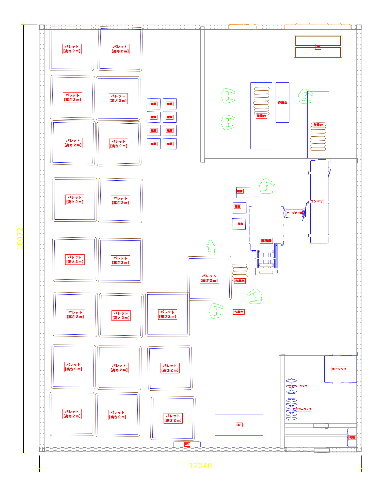
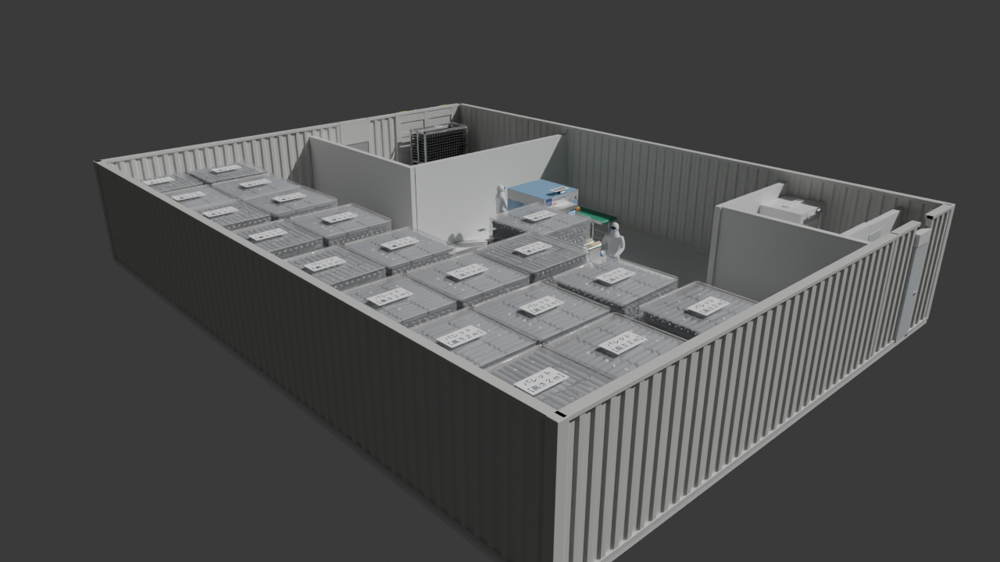

# CAD・プレゼン用 3D データ

`layout_realistic.blend10.2_full_name.blend` を CAD やプレゼンで使える形式に書き出したものです。
CAD 用ファイルは単位 **mm**、Z 軸が上、原点は Blender の原点（コンテナ外周の左下角）です。プレゼン用（GLB / FBX）は各ソフトの標準に合わせて単位 m・Y 軸が上で書き出しています。



## プレゼン用 3D



| ファイル | 内容 | 使い方 |
|---|---|---|
| `layout_presentation.glb` | 色付きの 3D モデル（約 104 万三角形・30MB）。名称ラベル付き | **PowerPoint**：挿入 → 3D モデル → このファイル。スライド上でドラッグして回転でき、「変形」画面切り替えで回転アニメーションも作れます。Keynote、Windows の 3D ビューアーでも開けます |
| `layout_presentation.fbx` | 同じモデルの FBX 版（7MB） | 3ds Max / SketchUp / Revit / Twinmotion / Lumion など |
| `export_presentation.py` | 上記を書き出すスクリプト | 再書き出し用 |

- Blender の模様（床の色ムラ、汚れ、凹凸など）は他のソフトに渡せないため、各マテリアルを**単色＋つや・金属感**に置き換えています。ガラス、青いアクリル、ストレッチフィルムは半透明です。
- 軽くするため、パレット上の菌棒などは形を間引いています（全体で約 300 万 → 約 104 万三角形）。
- 照明とカメラは含めていません。表示するソフト側の照明で見え方が変わります。

## CAD 用ファイル

| ファイル | 内容 | 主な用途 |
|---|---|---|
| `layout_plan.dxf` | 2D 平面図（DXF 2013）。上から見た各設備の外形線、名称ラベル（文字は輪郭線＋塗りつぶし）、全体寸法 12,040 × 16,072 | AutoCAD / BricsCAD / DraftSight / Fusion のスケッチ |
| `layout_plan_R12.dxf` | 同じ平面図を DXF R12・Shift-JIS で（塗りつぶしと寸法オブジェクトは線と文字に置き換え） | Jw_cad など古い DXF しか読めないソフト |
| `layout_blocks.step` | 簡易ソリッド（STEP AP214）。各設備を「平面形状 × 高さ」で押し出した立体 184 個。部品ごとに名前（`設備_R_接種機` など）と色付き | SolidWorks / Inventor / Fusion / FreeCAD / CATIA |
| `layout_3d_obj.zip` | 3D 詳細モデル（OBJ + MTL、展開すると約 190MB）。Blender の見た目そのままのメッシュで、オブジェクトごとのグループと色付き | Rhino / SketchUp / Fusion（メッシュ）/ 3ds Max |
| `layout_3d.glb` | 3D 詳細モデル（glTF バイナリ） | Web ビューア、Revit・SketchUp のプラグイン等 |
| `export_cad.py` | 上記を書き出すスクリプト | 再書き出し用 |

### DXF の画層

| 画層 | 内容 |
|---|---|
| 壁 | コンテナ外周壁（波板形状）・仕切り壁 |
| 扉 | 観音開き扉・片開き扉 |
| 床 | 床スラブ・鉄板床・土間 |
| 設備 | 接種機・コンベヤ・テープ貼り機・作業台・棚・パレット など |
| 荷 | パレット上の菌棒・トレー・菌床袋 |
| 人 | 作業者 |
| 名称ラベル | 元モデルの名称ラベル（「パレット【高さ2m】」など） |
| 寸法 | 全体寸法 |

## 注意

- STEP は**簡易形状**です。上から見た外形をそのまま高さ方向に押し出しているので、扉の開口や機械の細部は入っていません。レイアウト検討・干渉確認用と考えてください。細部が必要なときは OBJ / glTF のメッシュを使ってください。
- メッシュ（OBJ / glTF）は約 300 万三角形あります。CAD によっては読み込みに時間がかかります。
- 天井・照明・カメラは含めていません。

## 再書き出し

```
pip install bpy ezdxf shapely cadquery-ocp
python export_cad.py 入力.blend 出力フォルダ          # STL も必要なら末尾に --stl（約150MB）
```
