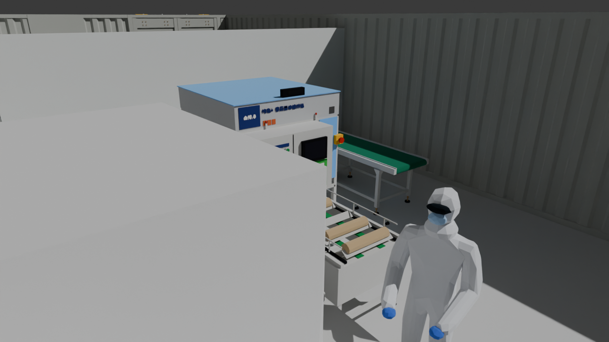

# CAD・プレゼン用 3D データ

`layout_realistic.blend10.2_full_name.blend` を CAD やプレゼンで使える形式に書き出したものです。
CAD 用ファイル（STEP / OBJ / DXF）は単位 **mm**、Z 軸が上、原点は Blender の原点（コンテナ外周の左下角）です。
プレゼン用（GLB / FBX）は各ソフトの標準に合わせて単位 m・Y 軸が上で書き出しています。

## どれを使えばいいか

| ソフト | レンダリング・見せる用 | 編集・寸法・干渉チェック用 |
|---|---|---|
| **Fusion** | `layout_detailed_step.zip`（展開した STEP をアップロード） | `layout_detailed_step.zip` / `layout_blocks.step` |
| **FreeCAD** | `layout_detailed_step.zip`（展開した STEP をインポート） | 同左 |
| PowerPoint / Keynote | `layout_presentation.glb`（挿入 → 3D モデル） | — |
| 3ds Max / SketchUp / Twinmotion / Lumion | `layout_presentation.fbx` | — |
| Rhino など（メッシュ） | `layout_light_obj.zip` / `layout_3d_obj.zip` | — |
| AutoCAD / Jw_cad（2D） | — | `layout_plan.dxf` / `layout_plan_R12.dxf` |

## 部品単位のソリッド（Fusion・FreeCAD のレンダリング向け）



`layout_detailed_step.zip` … 展開すると `layout_detailed.step`（85MB、STEP AP214）

- 設備ごとのアセンブリ（`設備_R_接種機`、`壁_R_波板_Wall` など 172 個）の中に、色ごとの部品が入っています。ソリッドは合計 3,949 個です。
- 色は元のマテリアルの色です（模様・汚れは単色になります）。Fusion ではこの色が外観として読み込まれるので、そのままレンダリングできます。素材感を出したいときは、色ごとの部品に Fusion の外観（ステンレス、アクリルなど）をドラッグしてください。
- 形の作り方: 部品ごとに分けて、箱・円柱などの凸形状はそのまま正確なソリッドに、作業者や波板などはメッシュを閉じたソリッドにしています。
- 軽くするための簡略化:
  - パレットに積んだ菌棒は、外側のストレッチフィルムの外形（不透明な塊）だけにしています
  - トレー・菌棒・パレットは、接している同じ色の部品を 1 つの塊にまとめています
  - 円柱は角数を減らしています（設備は 20 角程度、荷は 10 角程度）
  - 15mm より小さい部品（ねじ頭など）は省いています。作業者はポリゴンを間引いています
  - 面取り（角の丸み）は入っていません
- 名称ラベル（「パレット【高さ2m】」など）は STEP には入れていません。
- 形状チェックでは 3,949 個中 1 個（約 0.8cm³ の小さな部品）だけ不正判定が出ます。読み込みで問題になる場合はその部品を消してください。
- 読み込みは Fusion・FreeCAD とも数分かかることがあります。

## プレゼン用 3D（メッシュ）


| ファイル | 内容 | 使い方 |
|---|---|---|
| `layout_presentation.glb` | 色付きの 3D モデル（約 146 万三角形・36MB）。名称ラベル付き。ガラス・アクリル・ストレッチフィルムは半透明 | **PowerPoint**：挿入 → 3D モデル → このファイル。スライド上でドラッグして回転でき、「変形」画面切り替えで回転アニメーションも作れます。Keynote、Windows の 3D ビューアーでも開けます |
| `layout_presentation.fbx` | 同じモデルの FBX 版 | 3ds Max / SketchUp / Revit / Twinmotion / Lumion など |
| `layout_light_obj.zip` | 軽量メッシュ（OBJ + MTL、約 54 万三角形、単位 mm）。設備ごとに分かれていて色付き。面取りなし、フィルム内の菌棒なし | FreeCAD（メッシュとして）、Fusion の「メッシュを挿入」（単位は mm を選択）、Rhino など |

- Blender の模様（床の色ムラ、汚れ、凹凸など）は他のソフトに渡せないため、各マテリアルを**単色＋つや・金属感**に置き換えています。
- 照明とカメラは含めていません。表示するソフト側の照明で見え方が変わります。

## その他の CAD 用ファイル

| ファイル | 内容 | 主な用途 |
|---|---|---|
| `layout_plan.dxf` | 2D 平面図（DXF 2013）。上から見た各設備の外形線、名称ラベル（文字は輪郭線＋塗りつぶし）、全体寸法 12,040 × 16,072 | AutoCAD / BricsCAD / DraftSight / Fusion のスケッチ |
| `layout_plan_R12.dxf` | 同じ平面図を DXF R12・Shift-JIS で（塗りつぶしと寸法オブジェクトは線と文字に置き換え） | Jw_cad など古い DXF しか読めないソフト |
| `layout_blocks.step` | ごく簡易なソリッド。各設備を「平面形状 × 高さ」で押し出した塊 184 個。軽いので配置検討向け | SolidWorks / Inventor / Fusion / FreeCAD |
| `layout_3d_obj.zip` | 細部まで入ったメッシュ（OBJ + MTL、約 300 万三角形、展開すると約 190MB） | 細部が必要なとき |


### DXF の画層

| 画層 | 内容 |
|---|---|
| 壁 | コンテナ外周壁（波板形状）・仕切り壁 |
| 扉 | 観音開き扉・片開き扉 |
| 床 | 床スラブ・鉄板床・土間 |
| 設備 | 接種機・コンベヤ・テープ貼り機・作業台・棚・パレット など |
| 荷 | パレット上の菌棒・トレー・菌床袋 |
| 人 | 作業者 |
| 名称ラベル | 元モデルの名称ラベル（「パレット【高さ2m】」など） |
| 寸法 | 全体寸法 |

天井・照明・カメラはどのファイルにも含めていません。

## 再書き出し

```
pip install bpy ezdxf shapely trimesh scipy cadquery-ocp
python export_step_detailed.py 入力.blend layout_detailed.step   # 部品単位のソリッド STEP（約1分）
python export_presentation.py  入力.blend 出力フォルダ           # GLB / FBX / 軽量 OBJ
python export_cad.py           入力.blend 出力フォルダ           # DXF / 簡易 STEP / 詳細 OBJ・GLB（STL は --stl）
```
